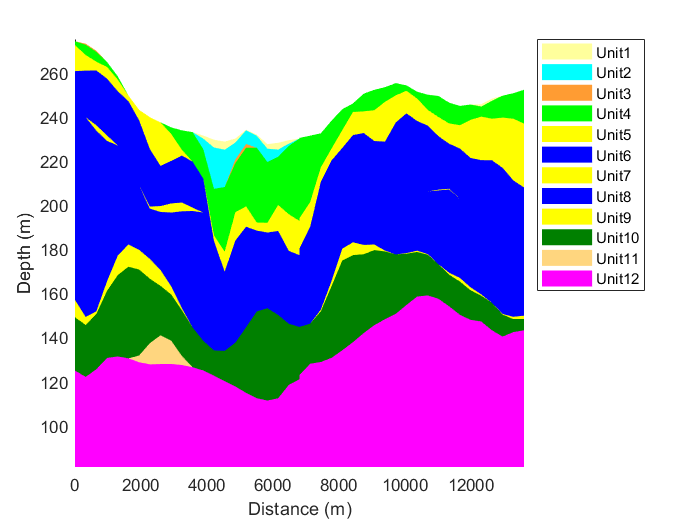

# matlab-tools

**Function geologicCrossSection.m** 
This function creates geological cross-section from known interfaces of geological units. 
Example: geologicCrossSection(data,[0 0],[6000 13000],rgb,200,2,30); 

